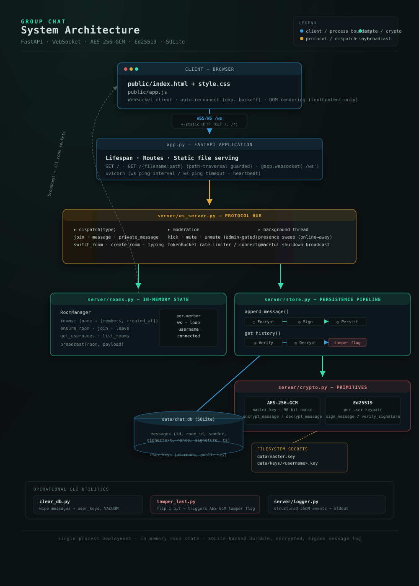

# 🟢 Group Chat

**A real-time, encrypted, multi-room chat server built with FastAPI and raw WebSockets — with authenticated encryption, digital signatures, and built-in tamper detection.**

[](https://www.python.org/)
[](https://fastapi.tiangolo.com/)
[](https://developer.mozilla.org/en-US/docs/Web/API/WebSockets_API)
[](#license)
[](#)

---

## Table of Contents

- [Overview](#overview)
- [Features](#features)
- [Architecture](#architecture)
- [Tech Stack](#tech-stack)
- [Project Structure](#project-structure)
- [Getting Started](#getting-started)
  - [Prerequisites](#prerequisites)
  - [Installation](#installation)
  - [Running the Server](#running-the-server)
  - [Running with Docker](#running-with-docker)
- [Configuration](#configuration)
- [Security Model](#security-model)
  - [Encryption & Signing Pipeline](#encryption--signing-pipeline)
  - [Tamper Detection](#tamper-detection)
  - [Key Management](#key-management)
  - [Known Limitations](#known-limitations)
- [WebSocket API Reference](#websocket-api-reference)
  - [Client → Server Events](#client--server-events)
  - [Server → Client Events](#server--client-events)
- [HTTP Routes](#http-routes)
- [Utility Scripts](#utility-scripts)
- [Rate Limiting](#rate-limiting)
- [Logging & Observability](#logging--observability)
- [Deployment Notes](#deployment-notes)
- [Troubleshooting](#troubleshooting)
- [Roadmap](#roadmap)
- [Contributing](#contributing)
- [License](#license)

---

## Overview

Group Chat is a lightweight, dependency-minimal chat server that demonstrates a production-style real-time messaging stack:

- A single FastAPI process serves both the static frontend and a `/ws` WebSocket endpoint.
- Every message is **encrypted at rest** (AES-256-GCM) and **cryptographically signed** (Ed25519) before being persisted to SQLite, and both are re-verified on every read.
- The frontend is dependency-free vanilla JS/HTML/CSS — no build step, no bundler, no framework.

It's designed to be easy to read end-to-end: the wire protocol, the crypto pipeline, and the room/presence logic are each isolated into their own small module.

## Features

| Category             | Details                                                                               |
| -------------------- | ------------------------------------------------------------------------------------- |
| **Rooms**            | Multi-room chat with join/switch/create; default rooms persist even when empty        |
| **Direct messages**  | 1-to-1 private messaging alongside room chat, with unread notifications               |
| **Presence**         | Live online/away/offline status; auto-away after a configurable idle timeout          |
| **Moderation**       | Admin usernames (configurable) get `kick` and `mute`/`unmute` powers                  |
| **UX niceties**      | Typing indicators, delivery receipts, character counter, sound + theme toggles        |
| **Resilience**       | Client auto-reconnects with exponential backoff (1s → 16s cap) on dropped sockets     |
| **History**          | Recent messages replayed on join / room switch, decrypted and verified on the fly     |
| **Security**         | AES-256-GCM encryption + Ed25519 signatures on every message, verified on read        |
| **Abuse prevention** | Per-connection sliding-window rate limiter (token bucket)                             |
| **Observability**    | Structured JSON logs for joins, disconnects, moderation actions, and server lifecycle |

## Architecture

<p align="center">
  
</p>

The request/data path flows top to bottom: the browser talks to `app.py` over HTTP (static assets) and a single `/ws` WebSocket connection; `ws_server.py` is the protocol hub that dispatches every event; `rooms.py` handles ephemeral in-memory membership and broadcast, while `store.py` drives the durable encrypt → sign → persist pipeline (and its mirror, verify → decrypt, on history reads) backed by `crypto.py` and SQLite.

- **`ws_server.py`** is the only module that understands the JSON wire protocol; everything else stays generic.
- **`rooms.py`** holds membership and broadcast logic purely in memory — no persistence.
- **`store.py`** owns the SQLite connection and the encrypt/sign/persist ↔ verify/decrypt round trip.
- **`crypto.py`** is a thin, isolated wrapper around the `cryptography` library's AEAD and signature primitives — the only file that touches raw key material.

## Tech Stack

| Layer              | Technology                                                                                   |
| ------------------ | -------------------------------------------------------------------------------------------- |
| Language           | Python 3.10+                                                                                 |
| Web framework      | [FastAPI](https://fastapi.tiangolo.com/)                                                     |
| ASGI server        | [uvicorn](https://www.uvicorn.org/) (`standard` extras: `websockets`, `httptools`, `uvloop`) |
| Realtime transport | Native WebSockets (via Starlette/FastAPI)                                                    |
| Cryptography       | [`cryptography`](https://cryptography.io/) — AES-256-GCM, Ed25519                            |
| Persistence        | SQLite (stdlib `sqlite3`)                                                                    |
| Frontend           | Vanilla HTML/CSS/JavaScript — no build tooling required                                      |

## Project Structure

```
.
├── app.py                   # FastAPI app: routes, WS endpoint, lifespan, entry point
├── clear_db.py                # CLI: wipe all messages & keys from the database
├── tamper_last.py              # CLI: corrupt the last stored message (tamper-detection demo)
├── requirements.txt
├── data/                        # Runtime data (git-ignored; created automatically)
│   ├── chat.db                    # SQLite database
│   ├── master.key                  # AES-256 master key
│   └── keys/                        # Per-user Ed25519 private keys
├── public/                       # Static frontend (served as-is, no build step)
│   ├── index.html
│   ├── app.js
│   └── style.css
└── server/
    ├── __init__.py
    ├── config.py                 # Environment-driven configuration
    ├── crypto.py                  # AES-GCM + Ed25519 primitives
    ├── logger.py                   # Structured JSON logging
    ├── rate_limiter.py              # Sliding-window token bucket
    ├── rooms.py                      # Room/member state + broadcast
    ├── store.py                       # SQLite persistence + crypto pipeline
    └── ws_server.py                    # WebSocket protocol handlers
```

## Getting Started

### Prerequisites

- Python **3.10+**
- `pip`

### Installation

```bash
git clone https://github.com/ashutosh229/group-chat-application.git
cd group-chat-application
python -m venv .venv
source .venv/bin/activate        # Windows: .venv\Scripts\activate
pip install -r requirements.txt
```

### Running the Server

```bash
python app.py
```

```
Group Chat server running (FastAPI):
  Local:   http://localhost:5000
  Network: http://<this-machine-IP>:5000  (use for other lab machines)
  Admins:  admin (set ADMIN_USERNAMES env var to change)
```

Open `http://localhost:5000` in a browser. To connect from another device on the same network, use the "Network" URL shown above and enter it as the **Server address** on the connect screen.

Join with the username `admin` (or any name listed in `ADMIN_USERNAMES`) to get moderator controls in the user list.

### Running with Docker

No `Dockerfile` ships with this repo yet, but the app is stateless aside from the `data/` directory, so containerizing it is straightforward:

```dockerfile
FROM python:3.12-slim
WORKDIR /app
COPY requirements.txt .
RUN pip install --no-cache-dir -r requirements.txt
COPY . .
EXPOSE 5000
CMD ["python", "app.py"]
```

```bash
docker build -t group-chat .
docker run -p 5000:5000 -v $(pwd)/data:/app/data group-chat
```

> Mount `data/` as a volume so the database and key material survive container restarts.

## Configuration

All configuration is environment-variable driven (see `server/config.py`) — no config file is required.

| Variable                | Default               | Description                                                          |
| ----------------------- | --------------------- | -------------------------------------------------------------------- |
| `PORT`                  | `5000`                | HTTP/WebSocket listen port                                           |
| `DEFAULT_ROOMS`         | `general,random,tech` | Comma-separated rooms that always exist, even empty                  |
| `ADMIN_USERNAMES`       | `admin`               | Comma-separated, case-insensitive usernames granted moderator powers |
| `HISTORY_LIMIT`         | `20`                  | Number of past messages replayed when a client joins/switches rooms  |
| `HEARTBEAT_INTERVAL_MS` | `30000`               | WebSocket ping interval/timeout (ms)                                 |
| `IDLE_TIMEOUT_MS`       | `100000`              | Idle time (ms) before a user is marked "away"                        |
| `RATE_LIMIT_BURST`      | `8`                   | Token bucket capacity per connection                                 |
| `RATE_LIMIT_REFILL`     | `2`                   | Tokens refilled per second per connection                            |

Fixed limits (in `server/config.py`, not environment-configurable): `MAX_USERNAME_LEN=20`, `MAX_MESSAGE_LEN=1000`, `MAX_ROOM_NAME_LEN=24`.

Example:

```bash
PORT=8080 ADMIN_USERNAMES=admin,shashank HISTORY_LIMIT=50 python app.py
```

## Security Model

### Encryption & Signing Pipeline

Every outgoing message is processed by `server/store.py::append_message` before it's ever written to disk:

1. **Encrypt** — plaintext is sealed with **AES-256-GCM** using a server-wide master key generated on first run and stored at `data/master.key`, with a fresh random 96-bit nonce per message.
2. **Sign** — a canonical payload (`msg_id | room_id | sender | timestamp | nonce | ciphertext`) is signed with the sender's **Ed25519** private key. Each username gets its own keypair, lazily generated on first message and stored under `data/keys/<username>.key`.
3. **Persist** — ciphertext, nonce, and signature are stored as hex strings in the `messages` table in `data/chat.db`.

On every history read (`get_history`), the pipeline runs in reverse and **fails closed**:

- The signature is verified against the sender's stored Ed25519 public key.
- The ciphertext is decrypted; AES-GCM's built-in authentication tag detects any modification.
- If decryption fails: the message text is replaced with `[TAMPERED: AES-GCM Integrity Check Failed - Ciphertext Modified]`.
- If the signature is invalid but decryption succeeds: the text is prefixed with `[UNVERIFIED SIGNATURE]`.
- Either failure sets `"verified": false` / `"tampered": true` on the message object sent to the client.

### Tamper Detection

Run `python tamper_last.py` to flip one bit in the ciphertext of the most recently stored message. Reload the affected room and the corrupted message will render as tampered — this is a deliberate demo of the AEAD authentication tag doing its job, not a bug.

### Key Management

- `data/master.key` is the single symmetric key protecting **all** message content. Anyone with this file can decrypt every stored message.
- `data/keys/<username>.key` holds each user's Ed25519 **private** key in raw form.
- **These files must be treated as secrets.** They are created automatically on first run and are not encrypted at rest themselves.
- Recommended for production: exclude `data/` from version control, restrict filesystem permissions (`chmod 600`), and back up `master.key` separately from `chat.db` (losing it makes all history permanently undecryptable).

### Known Limitations

- Authentication is username-only — there is no password, token, or identity verification, so usernames are trust-on-first-use. Anyone can claim any unused username, and admin status is granted purely by matching `ADMIN_USERNAMES`.
- All messages share a single symmetric master key rather than per-room or per-conversation keys — this protects data at rest against tampering/inspection but is not true end-to-end encryption between users (the server can always decrypt).
- No TLS/WSS termination is built in — put this behind a reverse proxy (nginx, Caddy, Traefik) with TLS in any environment reachable outside a trusted network.
- No CSRF or origin checking is performed on the WebSocket handshake — recommended to add if deploying beyond a local/lab network.

## WebSocket API Reference

All application traffic (after the initial page load) flows over a single `/ws` WebSocket connection as JSON text frames.

### Client → Server Events

| Type              | Payload              | Notes                                                                               |
| ----------------- | -------------------- | ----------------------------------------------------------------------------------- |
| `join`            | `{ username, room }` | First message on every connection; server assigns a de-duplicated username if taken |
| `message`         | `{ text }`           | Sent to the client's current room                                                   |
| `private_message` | `{ to, text }`       | Direct message to another online user                                               |
| `switch_room`     | `{ room }`           | Must be an existing room                                                            |
| `create_room`     | `{ room }`           | `1–24` chars, `[a-zA-Z0-9_-]` only; also switches the client into it                |
| `typing`          | `{}`                 | Broadcast to the client's current room                                              |
| `kick`            | `{ target }`         | **Admin only**                                                                      |
| `mute` / `unmute` | `{ target }`         | **Admin only**                                                                      |

### Server → Client Events

| Type              | Payload                                                                                                                |
| ----------------- | ---------------------------------------------------------------------------------------------------------------------- |
| `welcome`         | `{ username, room, isAdmin, users, rooms, onlineUsers, history }`                                                      |
| `notification`    | `{ text, users, room }`                                                                                                |
| `message`         | `{ id, username, text, room, timestamp }`                                                                              |
| `private_message` | `{ id, from, to, text, timestamp }`                                                                                    |
| `room_switched`   | `{ room, users, history }`                                                                                             |
| `room_list`       | `{ rooms }`                                                                                                            |
| `presence`        | `{ username, status }` — `online` \| `away` \| `offline`                                                               |
| `typing`          | `{ username, room }`                                                                                                   |
| `delivered`       | `{ id }`                                                                                                               |
| `error`           | `{ text, code }` — codes include `muted`, `rate_limited`, `no_such_room`, `bad_room_name`, `user_offline`, `not_admin` |
| `kicked`          | `{ by }`                                                                                                               |
| `system_shutdown` | `{ text }`                                                                                                             |

## HTTP Routes

| Method | Path               | Description                                                                                                                                                              |
| ------ | ------------------ | ------------------------------------------------------------------------------------------------------------------------------------------------------------------------ |
| `GET`  | `/`                | Serves `public/index.html`                                                                                                                                               |
| `GET`  | `/{filename:path}` | Serves any file under `public/`; falls back to `index.html` for unknown paths (SPA-style routing); path traversal is blocked by resolving and validating the target path |
| `WS`   | `/ws`              | The chat WebSocket endpoint                                                                                                                                              |

## Utility Scripts

**`clear_db.py`** — deletes all rows from `messages` and `user_keys`, then runs `VACUUM` to reclaim disk space. Destructive and irreversible.

```bash
python clear_db.py
```

**`tamper_last.py`** — flips the low bit of the first ciphertext byte of the most recently stored message, simulating data-at-rest tampering. Use it to demonstrate the tamper-detection path described [above](#tamper-detection).

```bash
python tamper_last.py
```

## Rate Limiting

Each connection gets its own `TokenBucket` (`server/rate_limiter.py`), implemented as a sliding-window counter (current + weighted-previous window) rather than a naive fixed window, to avoid burst-at-boundary abuse. Defaults: burst capacity `8`, refill rate `2`/second — tune via `RATE_LIMIT_BURST` / `RATE_LIMIT_REFILL`. Exceeding the limit returns a `rate_limited` error event instead of dropping the connection.

## Logging & Observability

`server/logger.py` emits one JSON object per line to stdout for every significant event (`server_start`, `join`, `disconnect`, `room_created`, `moderation_kick`, `moderation_mute`, `moderation_unmute`, `socket_error`, etc.), each timestamped in UTC ISO-8601. This format is designed to be piped directly into `jq`, a log shipper, or an aggregator:

```bash
python app.py | jq 'select(.event == "join")'
```

uvicorn's own access logs are suppressed (`log_level='warning'`) so this structured log is the single source of truth for server activity.

## Deployment Notes

- Run behind a reverse proxy that terminates TLS and forwards WebSocket upgrades (e.g., nginx `proxy_pass` with `Upgrade`/`Connection` headers, or Caddy's automatic HTTPS).
- Use `wss://` in the frontend's server-address field once TLS is in place.
- Persist the `data/` directory on a durable volume; back up `master.key` and `chat.db` together, and store a separate copy of `master.key` — it cannot be regenerated without losing access to all existing history.
- Presence sweeping and shutdown broadcasting run on a background daemon thread and are coordinated with the asyncio event loop via `run_coroutine_threadsafe`; this is safe for a single-process deployment but the app does not currently support horizontal scaling across multiple processes/nodes (room and presence state is in-memory, per-process).

## Troubleshooting

| Symptom                                | Likely cause                                                                                                                                       |
| -------------------------------------- | -------------------------------------------------------------------------------------------------------------------------------------------------- |
| "Could not connect" on the join screen | Wrong server address, server not running, or a firewall blocking the port                                                                          |
| Messages show `[TAMPERED: ...]`        | Ciphertext was modified after being written (see [Tamper Detection](#tamper-detection)) — expected if you ran `tamper_last.py`                     |
| Messages show `[UNVERIFIED SIGNATURE]` | The stored signature no longer matches the sender's public key — check whether `data/keys/<user>.key` was regenerated or `data/master.key` changed |
| Reconnect loop never stops             | Client-side backoff caps at 16s and keeps retrying by design until the server is reachable again                                                   |
| Admin controls not showing             | Username doesn't (case-insensitively) match `ADMIN_USERNAMES`                                                                                      |

## Future Roadmap and Plans

- [ ] Password/token-based authentication
- [ ] Per-room or per-conversation encryption keys
- [ ] Built-in TLS/WSS support
- [ ] Horizontal scaling (shared room/presence state via Redis or similar)
- [ ] Automated test suite (unit + WebSocket integration tests)
- [ ] Dockerfile and CI pipeline

## Contributing

Contributions are welcome:

1. Fork the repository and create a feature branch.
2. Keep the module boundaries intact — `ws_server.py` owns the wire protocol, `store.py`/`crypto.py` own persistence and cryptography, `rooms.py` stays in-memory-only.
3. Run the app locally and manually verify chat, DMs, room switching, and moderation still work before submitting a PR.
4. Open a pull request describing the change and its motivation.

## License

This project is licensed under the [MIT License](LICENSE).
